<html xmlns:v="urn:schemas-microsoft-com:vml"
xmlns:o="urn:schemas-microsoft-com:office:office"
xmlns:w="urn:schemas-microsoft-com:office:word"
xmlns:m="http://schemas.microsoft.com/office/2004/12/omml"
xmlns="http://www.w3.org/TR/REC-html40">

<head>
<meta http-equiv=Content-Type content="text/html; charset=windows-1252">
<meta name=ProgId content=Word.Document>
<meta name=Generator content="Microsoft Word 12">
<meta name=Originator content="Microsoft Word 12">
<link rel=File-List href="README_files/filelist.xml">
<link rel=Edit-Time-Data href="README_files/editdata.mso">
<!--[if !mso]>
<![endif]--><!--[if gte mso 9]><xml>
 <o:DocumentProperties>
  <o:Author>EasyTutz</o:Author>
  <o:Template>Normal</o:Template>
  <o:LastAuthor>EasyTutz</o:LastAuthor>
  <o:Revision>2</o:Revision>
  <o:TotalTime>102</o:TotalTime>
  <o:Created>2022-05-15T01:27:00Z</o:Created>
  <o:LastSaved>2022-05-15T01:27:00Z</o:LastSaved>
  <o:Pages>9</o:Pages>
  <o:Words>193</o:Words>
  <o:Characters>1101</o:Characters>
  <o:Lines>9</o:Lines>
  <o:Paragraphs>2</o:Paragraphs>
  <o:CharactersWithSpaces>1292</o:CharactersWithSpaces>
  <o:Version>12.00</o:Version>
 </o:DocumentProperties>
</xml><![endif]-->
<link rel=themeData href="README_files/themedata.thmx">
<link rel=colorSchemeMapping href="README_files/colorschememapping.xml">
<!--[if gte mso 9]><xml>
 <w:WordDocument>
  <w:TrackMoves>false</w:TrackMoves>
  <w:TrackFormatting/>
  <w:PunctuationKerning/>
  <w:ValidateAgainstSchemas/>
  <w:SaveIfXMLInvalid>false</w:SaveIfXMLInvalid>
  <w:IgnoreMixedContent>false</w:IgnoreMixedContent>
  <w:AlwaysShowPlaceholderText>false</w:AlwaysShowPlaceholderText>
  <w:DoNotPromoteQF/>
  <w:LidThemeOther>EN-US</w:LidThemeOther>
  <w:LidThemeAsian>X-NONE</w:LidThemeAsian>
  <w:LidThemeComplexScript>X-NONE</w:LidThemeComplexScript>
  <w:Compatibility>
   <w:BreakWrappedTables/>
   <w:SnapToGridInCell/>
   <w:WrapTextWithPunct/>
   <w:UseAsianBreakRules/>
   <w:DontGrowAutofit/>
   <w:SplitPgBreakAndParaMark/>
   <w:DontVertAlignCellWithSp/>
   <w:DontBreakConstrainedForcedTables/>
   <w:DontVertAlignInTxbx/>
   <w:Word11KerningPairs/>
   <w:CachedColBalance/>
  </w:Compatibility>
  <m:mathPr>
   <m:mathFont m:val="Cambria Math"/>
   <m:brkBin m:val="before"/>
   <m:brkBinSub m:val="--"/>
   <m:smallFrac m:val="off"/>
   <m:dispDef/>
   <m:lMargin m:val="0"/>
   <m:rMargin m:val="0"/>
   <m:defJc m:val="centerGroup"/>
   <m:wrapIndent m:val="1440"/>
   <m:intLim m:val="subSup"/>
   <m:naryLim m:val="undOvr"/>
  </m:mathPr></w:WordDocument>
</xml><![endif]--><!--[if gte mso 9]><xml>
 <w:LatentStyles DefLockedState="false" DefUnhideWhenUsed="true"
  DefSemiHidden="true" DefQFormat="false" DefPriority="99"
  LatentStyleCount="267">
  <w:LsdException Locked="false" Priority="0" SemiHidden="false"
   UnhideWhenUsed="false" QFormat="true" Name="Normal"/>
  <w:LsdException Locked="false" Priority="9" SemiHidden="false"
   UnhideWhenUsed="false" QFormat="true" Name="heading 1"/>
  <w:LsdException Locked="false" Priority="9" QFormat="true" Name="heading 2"/>
  <w:LsdException Locked="false" Priority="9" QFormat="true" Name="heading 3"/>
  <w:LsdException Locked="false" Priority="9" QFormat="true" Name="heading 4"/>
  <w:LsdException Locked="false" Priority="9" QFormat="true" Name="heading 5"/>
  <w:LsdException Locked="false" Priority="9" QFormat="true" Name="heading 6"/>
  <w:LsdException Locked="false" Priority="9" QFormat="true" Name="heading 7"/>
  <w:LsdException Locked="false" Priority="9" QFormat="true" Name="heading 8"/>
  <w:LsdException Locked="false" Priority="9" QFormat="true" Name="heading 9"/>
  <w:LsdException Locked="false" Priority="39" Name="toc 1"/>
  <w:LsdException Locked="false" Priority="39" Name="toc 2"/>
  <w:LsdException Locked="false" Priority="39" Name="toc 3"/>
  <w:LsdException Locked="false" Priority="39" Name="toc 4"/>
  <w:LsdException Locked="false" Priority="39" Name="toc 5"/>
  <w:LsdException Locked="false" Priority="39" Name="toc 6"/>
  <w:LsdException Locked="false" Priority="39" Name="toc 7"/>
  <w:LsdException Locked="false" Priority="39" Name="toc 8"/>
  <w:LsdException Locked="false" Priority="39" Name="toc 9"/>
  <w:LsdException Locked="false" Priority="35" QFormat="true" Name="caption"/>
  <w:LsdException Locked="false" Priority="10" SemiHidden="false"
   UnhideWhenUsed="false" QFormat="true" Name="Title"/>
  <w:LsdException Locked="false" Priority="1" Name="Default Paragraph Font"/>
  <w:LsdException Locked="false" Priority="11" SemiHidden="false"
   UnhideWhenUsed="false" QFormat="true" Name="Subtitle"/>
  <w:LsdException Locked="false" Priority="22" SemiHidden="false"
   UnhideWhenUsed="false" QFormat="true" Name="Strong"/>
  <w:LsdException Locked="false" Priority="20" SemiHidden="false"
   UnhideWhenUsed="false" QFormat="true" Name="Emphasis"/>
  <w:LsdException Locked="false" Priority="39" SemiHidden="false"
   UnhideWhenUsed="false" Name="Table Grid"/>
  <w:LsdException Locked="false" UnhideWhenUsed="false" Name="Placeholder Text"/>
  <w:LsdException Locked="false" Priority="1" SemiHidden="false"
   UnhideWhenUsed="false" QFormat="true" Name="No Spacing"/>
  <w:LsdException Locked="false" Priority="60" SemiHidden="false"
   UnhideWhenUsed="false" Name="Light Shading"/>
  <w:LsdException Locked="false" Priority="61" SemiHidden="false"
   UnhideWhenUsed="false" Name="Light List"/>
  <w:LsdException Locked="false" Priority="62" SemiHidden="false"
   UnhideWhenUsed="false" Name="Light Grid"/>
  <w:LsdException Locked="false" Priority="63" SemiHidden="false"
   UnhideWhenUsed="false" Name="Medium Shading 1"/>
  <w:LsdException Locked="false" Priority="64" SemiHidden="false"
   UnhideWhenUsed="false" Name="Medium Shading 2"/>
  <w:LsdException Locked="false" Priority="65" SemiHidden="false"
   UnhideWhenUsed="false" Name="Medium List 1"/>
  <w:LsdException Locked="false" Priority="66" SemiHidden="false"
   UnhideWhenUsed="false" Name="Medium List 2"/>
  <w:LsdException Locked="false" Priority="67" SemiHidden="false"
   UnhideWhenUsed="false" Name="Medium Grid 1"/>
  <w:LsdException Locked="false" Priority="68" SemiHidden="false"
   UnhideWhenUsed="false" Name="Medium Grid 2"/>
  <w:LsdException Locked="false" Priority="69" SemiHidden="false"
   UnhideWhenUsed="false" Name="Medium Grid 3"/>
  <w:LsdException Locked="false" Priority="70" SemiHidden="false"
   UnhideWhenUsed="false" Name="Dark List"/>
  <w:LsdException Locked="false" Priority="71" SemiHidden="false"
   UnhideWhenUsed="false" Name="Colorful Shading"/>
  <w:LsdException Locked="false" Priority="72" SemiHidden="false"
   UnhideWhenUsed="false" Name="Colorful List"/>
  <w:LsdException Locked="false" Priority="73" SemiHidden="false"
   UnhideWhenUsed="false" Name="Colorful Grid"/>
  <w:LsdException Locked="false" Priority="60" SemiHidden="false"
   UnhideWhenUsed="false" Name="Light Shading Accent 1"/>
  <w:LsdException Locked="false" Priority="61" SemiHidden="false"
   UnhideWhenUsed="false" Name="Light List Accent 1"/>
  <w:LsdException Locked="false" Priority="62" SemiHidden="false"
   UnhideWhenUsed="false" Name="Light Grid Accent 1"/>
  <w:LsdException Locked="false" Priority="63" SemiHidden="false"
   UnhideWhenUsed="false" Name="Medium Shading 1 Accent 1"/>
  <w:LsdException Locked="false" Priority="64" SemiHidden="false"
   UnhideWhenUsed="false" Name="Medium Shading 2 Accent 1"/>
  <w:LsdException Locked="false" Priority="65" SemiHidden="false"
   UnhideWhenUsed="false" Name="Medium List 1 Accent 1"/>
  <w:LsdException Locked="false" UnhideWhenUsed="false" Name="Revision"/>
  <w:LsdException Locked="false" Priority="34" SemiHidden="false"
   UnhideWhenUsed="false" QFormat="true" Name="List Paragraph"/>
  <w:LsdException Locked="false" Priority="29" SemiHidden="false"
   UnhideWhenUsed="false" QFormat="true" Name="Quote"/>
  <w:LsdException Locked="false" Priority="30" SemiHidden="false"
   UnhideWhenUsed="false" QFormat="true" Name="Intense Quote"/>
  <w:LsdException Locked="false" Priority="66" SemiHidden="false"
   UnhideWhenUsed="false" Name="Medium List 2 Accent 1"/>
  <w:LsdException Locked="false" Priority="67" SemiHidden="false"
   UnhideWhenUsed="false" Name="Medium Grid 1 Accent 1"/>
  <w:LsdException Locked="false" Priority="68" SemiHidden="false"
   UnhideWhenUsed="false" Name="Medium Grid 2 Accent 1"/>
  <w:LsdException Locked="false" Priority="69" SemiHidden="false"
   UnhideWhenUsed="false" Name="Medium Grid 3 Accent 1"/>
  <w:LsdException Locked="false" Priority="70" SemiHidden="false"
   UnhideWhenUsed="false" Name="Dark List Accent 1"/>
  <w:LsdException Locked="false" Priority="71" SemiHidden="false"
   UnhideWhenUsed="false" Name="Colorful Shading Accent 1"/>
  <w:LsdException Locked="false" Priority="72" SemiHidden="false"
   UnhideWhenUsed="false" Name="Colorful List Accent 1"/>
  <w:LsdException Locked="false" Priority="73" SemiHidden="false"
   UnhideWhenUsed="false" Name="Colorful Grid Accent 1"/>
  <w:LsdException Locked="false" Priority="60" SemiHidden="false"
   UnhideWhenUsed="false" Name="Light Shading Accent 2"/>
  <w:LsdException Locked="false" Priority="61" SemiHidden="false"
   UnhideWhenUsed="false" Name="Light List Accent 2"/>
  <w:LsdException Locked="false" Priority="62" SemiHidden="false"
   UnhideWhenUsed="false" Name="Light Grid Accent 2"/>
  <w:LsdException Locked="false" Priority="63" SemiHidden="false"
   UnhideWhenUsed="false" Name="Medium Shading 1 Accent 2"/>
  <w:LsdException Locked="false" Priority="64" SemiHidden="false"
   UnhideWhenUsed="false" Name="Medium Shading 2 Accent 2"/>
  <w:LsdException Locked="false" Priority="65" SemiHidden="false"
   UnhideWhenUsed="false" Name="Medium List 1 Accent 2"/>
  <w:LsdException Locked="false" Priority="66" SemiHidden="false"
   UnhideWhenUsed="false" Name="Medium List 2 Accent 2"/>
  <w:LsdException Locked="false" Priority="67" SemiHidden="false"
   UnhideWhenUsed="false" Name="Medium Grid 1 Accent 2"/>
  <w:LsdException Locked="false" Priority="68" SemiHidden="false"
   UnhideWhenUsed="false" Name="Medium Grid 2 Accent 2"/>
  <w:LsdException Locked="false" Priority="69" SemiHidden="false"
   UnhideWhenUsed="false" Name="Medium Grid 3 Accent 2"/>
  <w:LsdException Locked="false" Priority="70" SemiHidden="false"
   UnhideWhenUsed="false" Name="Dark List Accent 2"/>
  <w:LsdException Locked="false" Priority="71" SemiHidden="false"
   UnhideWhenUsed="false" Name="Colorful Shading Accent 2"/>
  <w:LsdException Locked="false" Priority="72" SemiHidden="false"
   UnhideWhenUsed="false" Name="Colorful List Accent 2"/>
  <w:LsdException Locked="false" Priority="73" SemiHidden="false"
   UnhideWhenUsed="false" Name="Colorful Grid Accent 2"/>
  <w:LsdException Locked="false" Priority="60" SemiHidden="false"
   UnhideWhenUsed="false" Name="Light Shading Accent 3"/>
  <w:LsdException Locked="false" Priority="61" SemiHidden="false"
   UnhideWhenUsed="false" Name="Light List Accent 3"/>
  <w:LsdException Locked="false" Priority="62" SemiHidden="false"
   UnhideWhenUsed="false" Name="Light Grid Accent 3"/>
  <w:LsdException Locked="false" Priority="63" SemiHidden="false"
   UnhideWhenUsed="false" Name="Medium Shading 1 Accent 3"/>
  <w:LsdException Locked="false" Priority="64" SemiHidden="false"
   UnhideWhenUsed="false" Name="Medium Shading 2 Accent 3"/>
  <w:LsdException Locked="false" Priority="65" SemiHidden="false"
   UnhideWhenUsed="false" Name="Medium List 1 Accent 3"/>
  <w:LsdException Locked="false" Priority="66" SemiHidden="false"
   UnhideWhenUsed="false" Name="Medium List 2 Accent 3"/>
  <w:LsdException Locked="false" Priority="67" SemiHidden="false"
   UnhideWhenUsed="false" Name="Medium Grid 1 Accent 3"/>
  <w:LsdException Locked="false" Priority="68" SemiHidden="false"
   UnhideWhenUsed="false" Name="Medium Grid 2 Accent 3"/>
  <w:LsdException Locked="false" Priority="69" SemiHidden="false"
   UnhideWhenUsed="false" Name="Medium Grid 3 Accent 3"/>
  <w:LsdException Locked="false" Priority="70" SemiHidden="false"
   UnhideWhenUsed="false" Name="Dark List Accent 3"/>
  <w:LsdException Locked="false" Priority="71" SemiHidden="false"
   UnhideWhenUsed="false" Name="Colorful Shading Accent 3"/>
  <w:LsdException Locked="false" Priority="72" SemiHidden="false"
   UnhideWhenUsed="false" Name="Colorful List Accent 3"/>
  <w:LsdException Locked="false" Priority="73" SemiHidden="false"
   UnhideWhenUsed="false" Name="Colorful Grid Accent 3"/>
  <w:LsdException Locked="false" Priority="60" SemiHidden="false"
   UnhideWhenUsed="false" Name="Light Shading Accent 4"/>
  <w:LsdException Locked="false" Priority="61" SemiHidden="false"
   UnhideWhenUsed="false" Name="Light List Accent 4"/>
  <w:LsdException Locked="false" Priority="62" SemiHidden="false"
   UnhideWhenUsed="false" Name="Light Grid Accent 4"/>
  <w:LsdException Locked="false" Priority="63" SemiHidden="false"
   UnhideWhenUsed="false" Name="Medium Shading 1 Accent 4"/>
  <w:LsdException Locked="false" Priority="64" SemiHidden="false"
   UnhideWhenUsed="false" Name="Medium Shading 2 Accent 4"/>
  <w:LsdException Locked="false" Priority="65" SemiHidden="false"
   UnhideWhenUsed="false" Name="Medium List 1 Accent 4"/>
  <w:LsdException Locked="false" Priority="66" SemiHidden="false"
   UnhideWhenUsed="false" Name="Medium List 2 Accent 4"/>
  <w:LsdException Locked="false" Priority="67" SemiHidden="false"
   UnhideWhenUsed="false" Name="Medium Grid 1 Accent 4"/>
  <w:LsdException Locked="false" Priority="68" SemiHidden="false"
   UnhideWhenUsed="false" Name="Medium Grid 2 Accent 4"/>
  <w:LsdException Locked="false" Priority="69" SemiHidden="false"
   UnhideWhenUsed="false" Name="Medium Grid 3 Accent 4"/>
  <w:LsdException Locked="false" Priority="70" SemiHidden="false"
   UnhideWhenUsed="false" Name="Dark List Accent 4"/>
  <w:LsdException Locked="false" Priority="71" SemiHidden="false"
   UnhideWhenUsed="false" Name="Colorful Shading Accent 4"/>
  <w:LsdException Locked="false" Priority="72" SemiHidden="false"
   UnhideWhenUsed="false" Name="Colorful List Accent 4"/>
  <w:LsdException Locked="false" Priority="73" SemiHidden="false"
   UnhideWhenUsed="false" Name="Colorful Grid Accent 4"/>
  <w:LsdException Locked="false" Priority="60" SemiHidden="false"
   UnhideWhenUsed="false" Name="Light Shading Accent 5"/>
  <w:LsdException Locked="false" Priority="61" SemiHidden="false"
   UnhideWhenUsed="false" Name="Light List Accent 5"/>
  <w:LsdException Locked="false" Priority="62" SemiHidden="false"
   UnhideWhenUsed="false" Name="Light Grid Accent 5"/>
  <w:LsdException Locked="false" Priority="63" SemiHidden="false"
   UnhideWhenUsed="false" Name="Medium Shading 1 Accent 5"/>
  <w:LsdException Locked="false" Priority="64" SemiHidden="false"
   UnhideWhenUsed="false" Name="Medium Shading 2 Accent 5"/>
  <w:LsdException Locked="false" Priority="65" SemiHidden="false"
   UnhideWhenUsed="false" Name="Medium List 1 Accent 5"/>
  <w:LsdException Locked="false" Priority="66" SemiHidden="false"
   UnhideWhenUsed="false" Name="Medium List 2 Accent 5"/>
  <w:LsdException Locked="false" Priority="67" SemiHidden="false"
   UnhideWhenUsed="false" Name="Medium Grid 1 Accent 5"/>
  <w:LsdException Locked="false" Priority="68" SemiHidden="false"
   UnhideWhenUsed="false" Name="Medium Grid 2 Accent 5"/>
  <w:LsdException Locked="false" Priority="69" SemiHidden="false"
   UnhideWhenUsed="false" Name="Medium Grid 3 Accent 5"/>
  <w:LsdException Locked="false" Priority="70" SemiHidden="false"
   UnhideWhenUsed="false" Name="Dark List Accent 5"/>
  <w:LsdException Locked="false" Priority="71" SemiHidden="false"
   UnhideWhenUsed="false" Name="Colorful Shading Accent 5"/>
  <w:LsdException Locked="false" Priority="72" SemiHidden="false"
   UnhideWhenUsed="false" Name="Colorful List Accent 5"/>
  <w:LsdException Locked="false" Priority="73" SemiHidden="false"
   UnhideWhenUsed="false" Name="Colorful Grid Accent 5"/>
  <w:LsdException Locked="false" Priority="60" SemiHidden="false"
   UnhideWhenUsed="false" Name="Light Shading Accent 6"/>
  <w:LsdException Locked="false" Priority="61" SemiHidden="false"
   UnhideWhenUsed="false" Name="Light List Accent 6"/>
  <w:LsdException Locked="false" Priority="62" SemiHidden="false"
   UnhideWhenUsed="false" Name="Light Grid Accent 6"/>
  <w:LsdException Locked="false" Priority="63" SemiHidden="false"
   UnhideWhenUsed="false" Name="Medium Shading 1 Accent 6"/>
  <w:LsdException Locked="false" Priority="64" SemiHidden="false"
   UnhideWhenUsed="false" Name="Medium Shading 2 Accent 6"/>
  <w:LsdException Locked="false" Priority="65" SemiHidden="false"
   UnhideWhenUsed="false" Name="Medium List 1 Accent 6"/>
  <w:LsdException Locked="false" Priority="66" SemiHidden="false"
   UnhideWhenUsed="false" Name="Medium List 2 Accent 6"/>
  <w:LsdException Locked="false" Priority="67" SemiHidden="false"
   UnhideWhenUsed="false" Name="Medium Grid 1 Accent 6"/>
  <w:LsdException Locked="false" Priority="68" SemiHidden="false"
   UnhideWhenUsed="false" Name="Medium Grid 2 Accent 6"/>
  <w:LsdException Locked="false" Priority="69" SemiHidden="false"
   UnhideWhenUsed="false" Name="Medium Grid 3 Accent 6"/>
  <w:LsdException Locked="false" Priority="70" SemiHidden="false"
   UnhideWhenUsed="false" Name="Dark List Accent 6"/>
  <w:LsdException Locked="false" Priority="71" SemiHidden="false"
   UnhideWhenUsed="false" Name="Colorful Shading Accent 6"/>
  <w:LsdException Locked="false" Priority="72" SemiHidden="false"
   UnhideWhenUsed="false" Name="Colorful List Accent 6"/>
  <w:LsdException Locked="false" Priority="73" SemiHidden="false"
   UnhideWhenUsed="false" Name="Colorful Grid Accent 6"/>
  <w:LsdException Locked="false" Priority="19" SemiHidden="false"
   UnhideWhenUsed="false" QFormat="true" Name="Subtle Emphasis"/>
  <w:LsdException Locked="false" Priority="21" SemiHidden="false"
   UnhideWhenUsed="false" QFormat="true" Name="Intense Emphasis"/>
  <w:LsdException Locked="false" Priority="31" SemiHidden="false"
   UnhideWhenUsed="false" QFormat="true" Name="Subtle Reference"/>
  <w:LsdException Locked="false" Priority="32" SemiHidden="false"
   UnhideWhenUsed="false" QFormat="true" Name="Intense Reference"/>
  <w:LsdException Locked="false" Priority="33" SemiHidden="false"
   UnhideWhenUsed="false" QFormat="true" Name="Book Title"/>
  <w:LsdException Locked="false" Priority="37" Name="Bibliography"/>
  <w:LsdException Locked="false" Priority="39" QFormat="true" Name="TOC Heading"/>
 </w:LatentStyles>
</xml><![endif]-->

</head>

<body lang=EN-US link=blue vlink=purple style='tab-interval:.5in'>

<a name="_Hlk60342005"><b style='mso-bidi-font-weight:normal'>Citizen
Portal Login Information 
Visit: </b></a><a href="https://citizenportal.xyz/"><b style='mso-bidi-font-weight:normal'>https://citizenportal.xyz/</b></a><b
style='mso-bidi-font-weight:normal'></b>

<b style='mso-bidi-font-weight:normal'>Client
Login: 
email: client@citizenportal.xyz 
password: client</b>

<b
style='mso-bidi-font-weight:normal'>Admin Login 
email: admin@citizenportal.xyz 
password: admin</b>

<b style='mso-bidi-font-weight:
normal'>The website is completely dynamic!</b>

<b style='mso-bidi-font-weight:
normal'>Screenshots</b>

<![if !supportLists]><b style='mso-bidi-font-weight:normal'>(1)</b><![endif]><b
style='mso-bidi-font-weight:normal'> CPortal Login  
<!--[if gte vml 1]><v:shapetype id="_x0000_t75"
 coordsize="21600,21600" o:spt="75" o:preferrelative="t" path="m@4@5l@4@11@9@11@9@5xe"
 filled="f" stroked="f">
 <v:stroke joinstyle="miter"/>
 <v:formulas>
  <v:f eqn="if lineDrawn pixelLineWidth 0"/>
  <v:f eqn="sum @0 1 0"/>
  <v:f eqn="sum 0 0 @1"/>
  <v:f eqn="prod @2 1 2"/>
  <v:f eqn="prod @3 21600 pixelWidth"/>
  <v:f eqn="prod @3 21600 pixelHeight"/>
  <v:f eqn="sum @0 0 1"/>
  <v:f eqn="prod @6 1 2"/>
  <v:f eqn="prod @7 21600 pixelWidth"/>
  <v:f eqn="sum @8 21600 0"/>
  <v:f eqn="prod @7 21600 pixelHeight"/>
  <v:f eqn="sum @10 21600 0"/>
 </v:formulas>
 <v:path o:extrusionok="f" gradientshapeok="t" o:connecttype="rect"/>
 <o:lock v:ext="edit" aspectratio="t"/>
</v:shapetype><v:shape id="Picture_x0020_10" o:spid="_x0000_i1043" type="#_x0000_t75"
 style='width:471.75pt;height:257.25pt;visibility:visible;mso-wrap-style:square'>
 <v:imagedata src="README_files/image001.png" o:title=""/>
</v:shape><![endif]--><![if !vml]>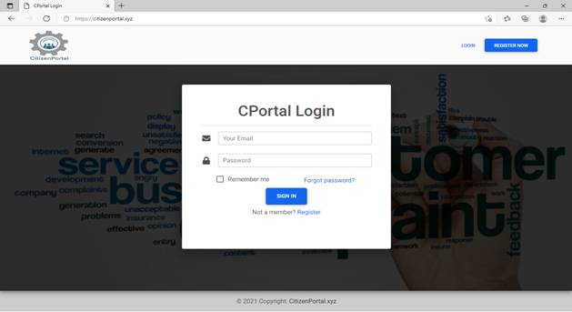<![endif]></b>

<![if !supportLists]><b style='mso-bidi-font-weight:normal'>(2)</b><![endif]><b
style='mso-bidi-font-weight:normal'> CPortal Registration Page 
<!--[if gte vml 1]><v:shape id="Picture_x0020_13"
 o:spid="_x0000_i1042" type="#_x0000_t75" style='width:471pt;height:271.5pt;
 visibility:visible;mso-wrap-style:square'>
 <v:imagedata src="README_files/image003.png" o:title=""/>
</v:shape><![endif]--><![if !vml]><![endif]></b>

<![if !supportLists]><b style='mso-bidi-font-weight:normal'>(3)</b><![endif]><b
style='mso-bidi-font-weight:normal'> Client Index Page 
<!--[if gte vml 1]><v:shape id="Picture_x0020_16"
 o:spid="_x0000_i1041" type="#_x0000_t75" style='width:471.75pt;height:259.5pt;
 visibility:visible;mso-wrap-style:square'>
 <v:imagedata src="README_files/image005.png" o:title=""/>
</v:shape><![endif]--><![if !vml]>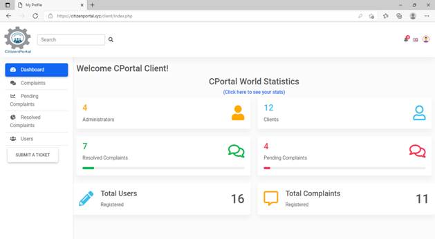<![endif]></b>

<![if !supportLists]><b style='mso-bidi-font-weight:normal'>(4)</b><![endif]><b
style='mso-bidi-font-weight:normal'>Client List of all complaints Area 
<!--[if gte vml 1]><v:shape id="Picture_x0020_19"
 o:spid="_x0000_i1040" type="#_x0000_t75" style='width:458.25pt;height:279pt;
 visibility:visible;mso-wrap-style:square'>
 <v:imagedata src="README_files/image007.png" o:title=""/>
</v:shape><![endif]--><![if !vml]>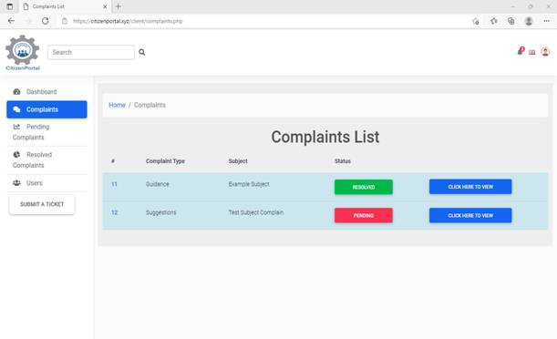<![endif]></b>

<![if !supportLists]><b style='mso-bidi-font-weight:normal'>(5)</b><![endif]><b
style='mso-bidi-font-weight:normal'> Pending Complaints List Area 
<!--[if gte vml 1]><v:shape id="Picture_x0020_22"
 o:spid="_x0000_i1039" type="#_x0000_t75" style='width:469.5pt;height:213.75pt;
 visibility:visible;mso-wrap-style:square'>
 <v:imagedata src="README_files/image009.png" o:title=""/>
</v:shape><![endif]--><![if !vml]>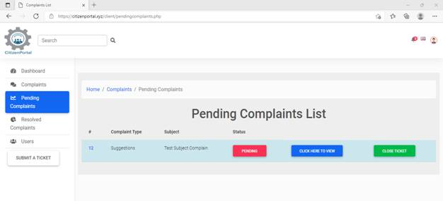<![endif]></b>

<![if !supportLists]><b style='mso-bidi-font-weight:normal'>(6)</b><![endif]><b
style='mso-bidi-font-weight:normal'> Resolved Complaints List Area 
<!--[if gte vml 1]><v:shape id="Picture_x0020_25"
 o:spid="_x0000_i1038" type="#_x0000_t75" style='width:458.25pt;height:238.5pt;
 visibility:visible;mso-wrap-style:square'>
 <v:imagedata src="README_files/image011.png" o:title=""/>
</v:shape><![endif]--><![if !vml]>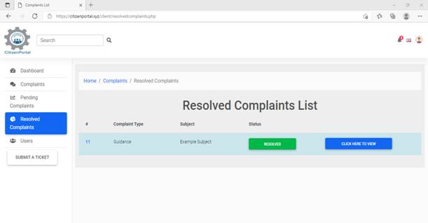<![endif]></b>

<![if !supportLists]><b style='mso-bidi-font-weight:normal'>(7)</b><![endif]><b
style='mso-bidi-font-weight:normal'> Users Page 
<!--[if gte vml 1]><v:shape id="Picture_x0020_28"
 o:spid="_x0000_i1037" type="#_x0000_t75" style='width:465.75pt;height:277.5pt;
 visibility:visible;mso-wrap-style:square'>
 <v:imagedata src="README_files/image013.png" o:title=""/>
</v:shape><![endif]--><![if !vml]>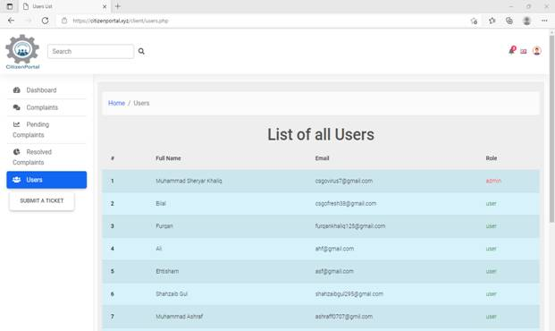<![endif]></b>

<![if !supportLists]><b style='mso-bidi-font-weight:normal'>(8)</b><![endif]><b
style='mso-bidi-font-weight:normal'> Submit a Ticket Page 
<!--[if gte vml 1]><v:shape id="Picture_x0020_31"
 o:spid="_x0000_i1036" type="#_x0000_t75" style='width:470.25pt;height:225pt;
 visibility:visible;mso-wrap-style:square'>
 <v:imagedata src="README_files/image015.png" o:title=""/>
</v:shape><![endif]--><![if !vml]>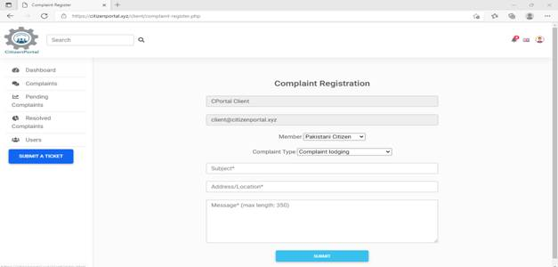<![endif]></b>

<![if !supportLists]><b style='mso-bidi-font-weight:normal'>(9)</b><![endif]><b
style='mso-bidi-font-weight:normal'>Notification bar 
<!--[if gte vml 1]><v:shape id="Picture_x0020_34"
 o:spid="_x0000_i1035" type="#_x0000_t75" style='width:239.25pt;height:96.75pt;
 visibility:visible;mso-wrap-style:square'>
 <v:imagedata src="README_files/image017.png" o:title=""/>
</v:shape><![endif]--><![if !vml]><![endif]></b>

<![if !supportLists]><b style='mso-bidi-font-weight:normal'>(10)&nbsp;&nbsp; </b><![endif]><b
style='mso-bidi-font-weight:normal'>Language Bar 
<!--[if gte vml 1]><v:shape id="Picture_x0020_37"
 o:spid="_x0000_i1034" type="#_x0000_t75" style='width:197.25pt;height:266.25pt;
 visibility:visible;mso-wrap-style:square'>
 <v:imagedata src="README_files/image019.png" o:title=""/>
</v:shape><![endif]--><![if !vml]>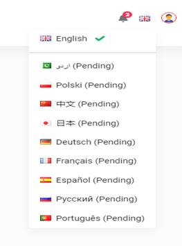<![endif]></b>

<![if !supportLists]><b style='mso-bidi-font-weight:normal'>(11)&nbsp;&nbsp; </b><![endif]><b
style='mso-bidi-font-weight:normal'>Profile Bar 
<!--[if gte vml 1]><v:shape id="Picture_x0020_40"
 o:spid="_x0000_i1033" type="#_x0000_t75" style='width:141.75pt;height:134.25pt;
 visibility:visible;mso-wrap-style:square'>
 <v:imagedata src="README_files/image021.png" o:title=""/>
</v:shape><![endif]--><![if !vml]><![endif]></b>

<![if !supportLists]><b style='mso-bidi-font-weight:normal'>(12)&nbsp;&nbsp; </b><![endif]><b
style='mso-bidi-font-weight:normal'>My Profile Page 
<!--[if gte vml 1]><v:shape id="Picture_x0020_43"
 o:spid="_x0000_i1032" type="#_x0000_t75" style='width:466.5pt;height:265.5pt;
 visibility:visible;mso-wrap-style:square'>
 <v:imagedata src="README_files/image023.png" o:title=""/>
</v:shape><![endif]--><![if !vml]>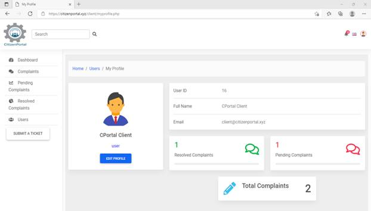<![endif]></b>

<![if !supportLists]><b style='mso-bidi-font-weight:normal'>(13)&nbsp;&nbsp; </b><![endif]><b
style='mso-bidi-font-weight:normal'>Edit Profile 
<!--[if gte vml 1]><v:shape id="Picture_x0020_46"
 o:spid="_x0000_i1031" type="#_x0000_t75" style='width:471pt;height:213pt;
 visibility:visible;mso-wrap-style:square'>
 <v:imagedata src="README_files/image025.png" o:title=""/>
</v:shape><![endif]--><![if !vml]><![endif]></b>

<b
style='mso-bidi-font-weight:normal'>Admin Interface</b>

<b style='mso-bidi-font-weight:
normal'>(admin interface is same like client interface, so I’ll place those
screenshots which are different from client interface)</b>

<![if !supportLists]><b style='mso-bidi-font-weight:normal'>(1)</b><![endif]><b
style='mso-bidi-font-weight:normal'> Pending Complaints List 
<!--[if gte vml 1]><v:shape id="Picture_x0020_49"
 o:spid="_x0000_i1030" type="#_x0000_t75" style='width:477.75pt;height:245.25pt;
 visibility:visible;mso-wrap-style:square'>
 <v:imagedata src="README_files/image027.png" o:title=""/>
</v:shape><![endif]--><![if !vml]>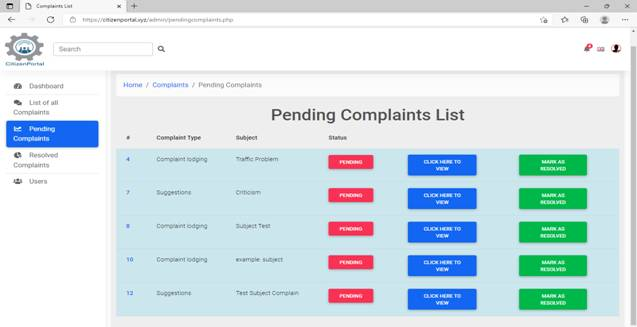<![endif]></b>

<![if !supportLists]><b style='mso-bidi-font-weight:normal'>(2)</b><![endif]><b
style='mso-bidi-font-weight:normal'> Resolved Complaints List 
<!--[if gte vml 1]><v:shape id="Picture_x0020_52"
 o:spid="_x0000_i1029" type="#_x0000_t75" style='width:477.75pt;height:288.75pt;
 visibility:visible;mso-wrap-style:square'>
 <v:imagedata src="README_files/image029.png" o:title=""/>
</v:shape><![endif]--><![if !vml]>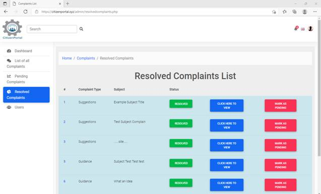<![endif]></b>

<![if !supportLists]><b style='mso-bidi-font-weight:normal'>(3)</b><![endif]><b
style='mso-bidi-font-weight:normal'> Users Page 
<!--[if gte vml 1]><v:shape id="Picture_x0020_55"
 o:spid="_x0000_i1028" type="#_x0000_t75" style='width:471pt;height:315.75pt;
 visibility:visible;mso-wrap-style:square'>
 <v:imagedata src="README_files/image031.png" o:title=""/>
</v:shape><![endif]--><![if !vml]><![endif]></b>

<![if !supportLists]><b style='mso-bidi-font-weight:normal'>(4)</b><![endif]><b
style='mso-bidi-font-weight:normal'> Notification Bar 
<!--[if gte vml 1]><v:shape id="Picture_x0020_58"
 o:spid="_x0000_i1027" type="#_x0000_t75" style='width:261pt;height:159pt;
 visibility:visible;mso-wrap-style:square'>
 <v:imagedata src="README_files/image033.png" o:title=""/>
</v:shape><![endif]--><![if !vml]>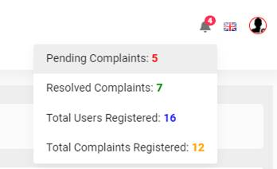<![endif]></b>

<![if !supportLists]><b style='mso-bidi-font-weight:normal'>(5)&nbsp; </b><![endif]><b
style='mso-bidi-font-weight:normal'> My Profile 
<!--[if gte vml 1]><v:shape id="Picture_x0020_61"
 o:spid="_x0000_i1026" type="#_x0000_t75" style='width:486.75pt;height:219pt;
 visibility:visible;mso-wrap-style:square'>
 <v:imagedata src="README_files/image035.png" o:title=""/>
</v:shape><![endif]--><![if !vml]><![endif]></b>There are no stats in (admin my profile page) because
admin can’t submit a ticket, it’s job is to mark complaints as pending/resolved
and give admin access or remove admin access of clients.

<b style='mso-bidi-font-weight:
normal'> 
</b><b style='mso-bidi-font-weight:
normal'>Source
Code is in compressed file named as : “citizenportal.zip”</b>

<b style='mso-bidi-font-weight:
normal'>Database
Information: 
hostname: localhost 
username: citi_cportal 
Password: CBrOdv#x*8-lL^hw 
Database: citi_cportal</b>

<b style='mso-bidi-font-weight:
normal'>Database
file: citi_cportal.sql </b>

<b style='mso-bidi-font-weight:
normal'>(once
the database is connected, tables will automatically be created)</b>

<b style='mso-bidi-font-weight:
normal'>THE END</b>

<o:p>&nbsp;</o:p>

</body>

</html>
